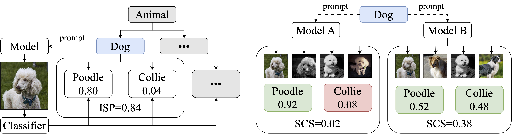

  

## Hypernymy Understanding Evaluation of Text-to-Image Models via WordNet Hierarchy

* `laion_400M/` – code for counting lemmas in laion_400M.
* `notebooks/` – jupyter notebooks with our analyses.
* `scripts/` – code for launching metric computations.
* `src/` – code for our metrics.
* `wordnet_classes/` – imagenet to wordnet mappings.

### Scripts

* `generate_images.py` – generates images for synsets from a diffusers text-to-image pipeline.
* `generate_images_glide.py` – generates images for synsets from GLIDE.
* `classify_images.py` – classifies the generated images.
* `calculate_metrics.py` – calculates the metrics from logits.
* `generate_coco.py` – generates MS-COCO samples from a diffusers text-to-image pipeline.
* `generate_coco_glide.py` – generates MS-COCO samples from GLIDE.

### Notebooks

* `analysis.ipynb` – computing the main metrics from logits, granular comparison, unknown concepts.
* `sweeps.ipynb` – guidance and number of diffusion steps sweep plots.
* `human_eval.ipynb` – human evaluation results.
* `coco_metrics.ipynb` – computing MS COCO metrics (FID and CLIPScore).
* `train_data_correlation.ipynb` – computing correlation between synset metric and frequency in dataset.

### How to evaluate a model

* Generate synset images from a model using `generate_images.py`.
  * Example: `python scripts/generate_images.py --model_name=CompVis/ldm-text2im-large-256 --images_per_synset=32 --remove_leaves=True --batch_size=16 --image_size=224 --images_path=PATH_TO_IMAGES --gpu_id=0 --use_float16=True`
* Classify them using `classify_images.py`.
  * Example: `python scripts/classify_images.py --model_name=vit_b_16 --images_path=PATH_TO_IMAGES --logits_path=PATH_TO_LOGITS --batch_size=256 --gpu_id=0`
* Calculate the metrics using `calculate_metrics.py`.
  * The metrics proposed in the paper are called `SubtreeInProb` and `SubtreeIS`.
  * Example: `python scripts/calculate_metrics.py --logits_path=PATH_TO_LOGITS/vit_b_16_logits.npz --metric_names=SubtreeInProb,SubtreeIS --metrics_path=PATH_TO_METRICS`
  * You also need to divide the SCS (SubtreeIS value) by `~1.6236` to get the leaderboard value.

For further details on how to run the scripts please read the absl app flags.
